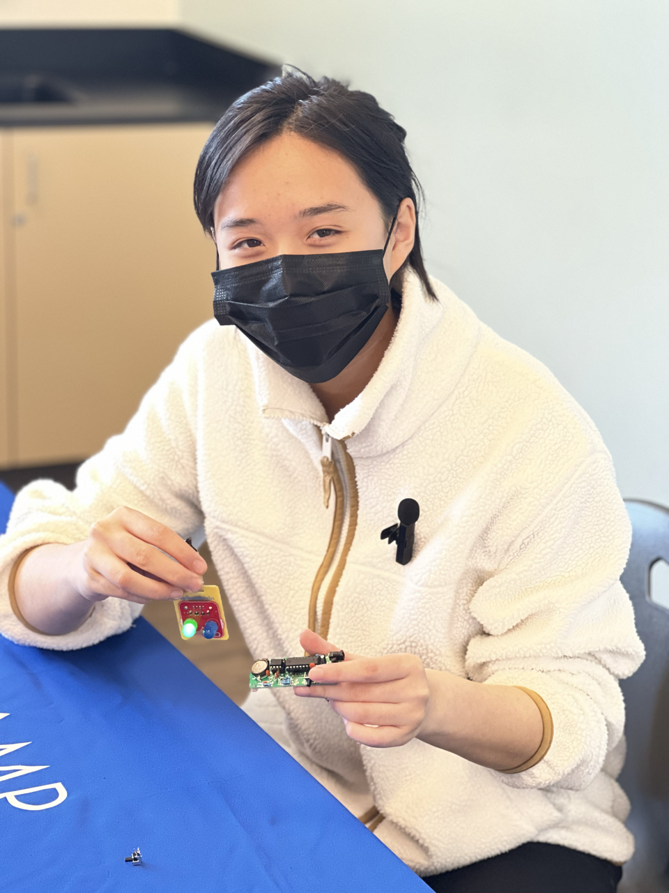

# Prank Trick-o-Treat Bowl
When I was a little kid, I have always wanted to prank the kids who would steal my candy. So, during this Halloween, with the use of an ultrasonic sensor, this special trick-o-treat bowl can detect any hand that is ten centimeters away that reaching to grab the candy. Once this sensor detects the hand, the wheels will move away from the hand, preventing the children from stealing my candy. 

| **Engineer** | **School** | **Area of Interest** | **Grade** |
|:--:|:--:|:--:|:--:|
| Claire L | Basis Independent Silicon Valley | Mechanical Engineering | Incoming Sophomore



<!--# Final Milestone
For your final milestone, explain the outcome of your project. Key details to include are:
- What you've accomplished since your previous milestone
- What your biggest challenges and triumphs were at BSE
- A summary of key topics you learned about
- What you hope to learn in the future after everything you've learned at B


**Don't forget to replace the text below with the embedding for your milestone video. Go to Youtube, click Share -> Embed, and copy and paste the code to replace what's below.**

<iframe width="560" height="315" src="https://www.youtube.com/embed/F7M7imOVGug" title="YouTube video player" frameborder="0" allow="accelerometer; autoplay; clipboard-write; encrypted-media; gyroscope; picture-in-picture; web-share" allowfullscreen></iframe>
-->
# Second Milestone
<iframe width="560" height="315" src="https://www.youtube.com/embed/Jjfn467eo7o" title="YouTube video player" frameborder="0" allow="accelerometer; autoplay; clipboard-write; encrypted-media; gyroscope; picture-in-picture; web-share" allowfullscreen></iframe>
After my ultrasonic sensor successfully worked, the next step was to connect the motors to the Ultrasonic sensors. If the ultrasonic sensor detects a distance greater than ten centimeters, the motors will spin. The L298 DCM driver, the red chip connected to the breadboard, Arduino Uno, and the motors, controls the direction and the speed of DC motors. A singular DCM driver can control up to two motors. There are four input plugs for the motor and four output plugs for the motor. The DCM driver has an H-bridge configuration, which is made out of four switches. Inside of the DCM driver there is also a voltage regulator, that regulates the voltage, so that nothing ever blows upfrom overheating. During my second miletsone, wires had to be connected, and I figured out the correct wiring due to circuit.io. I had a hard time getting the correct wiring, and had to recheck wiring multiple times I sometimes accidentally put the wires in the wrong spot and sometimes the wires would fall out, due to me dropping the project. Another challenge that I had was getting the USB connected to the Arduino Uno. That issue was solved by using a diferrent USB connector. Otherwise, my second milestone went really smoothly, compared to my first milestone and starter project. For my third milestone, I will be assembling everything together. Some changes I would want to make to this project is that to make it a trick-o-treat bowl where the bowl will move away in when a child tries to get the candy.

# First Milestone
<iframe width="560" height="315" src="https://www.youtube.com/embed/EVdSUeaPyqM" title="YouTube video player" frameborder="0" allow="accelerometer; autoplay; clipboard-write; encrypted-media; gyroscope; picture-in-picture; web-share" allowfullscreen></iframe>
y first milestone was to connect and test the ultrasonic sensor to my serial monitor. The ultrasonic sensor is a type of proximity sensor that transmits ultrasonic sound waves to detect the distance of an object. In the ultrasonic sensor there is a transmitter which sends out the soundwaves and a reciever that receives the soundwaves. Using the time it takes for the ultrasonic pulse to first reach to the object then to bounce back from the object divided by two and the speed of the pulse, the ultrasonic sensor can calculate the distance between the object and the ultrasonic sensor. Despite the fact that the ultrasonic sensor has a limited range in detecting objects from different angles, my project needed a ultrasonic sensor. M During the last two days, I have finished wiring and uploading the necessary code onto the serial monitor. I have learned to look up documentation to upload the code necessary to use the ultrasonic sensor. So far my project has gone really smoothly and there were no big challenges that I have to face at this time. My plan after this to add in the motors and incorporate the ultrasonic sensor into the motor.

# Starter Project
<iframe width="560" height="315" src="https://www.youtube.com/embed/-cQ8sZ7sLtw" title="YouTube video player" frameborder="0" allow="accelerometer; autoplay; clipboard-write; encrypted-media; gyroscope; picture-in-picture; web-share" allowfullscreen></iframe>

For my starter project, I originally supposed to work on the Arduino clock, however due a few mistakes that I made, I had a change of plans. !!! Although I didn't end up finishing the Arduino clock, I learned a lot. For example, I learned to follow instructions very closely and to solder everything. For example, the microcontroller was not fully soldered, due to the fact that I thought the microcontroller only needed to be soldered at the ends. Due to the microcontroller not being fully soldered, the LED display would also need to be desoldered, which is why I ended up making a Robot Badge which has two lights that blink. The Robot Badge has 

<!--# Schematics 
Here's where you'll put images of your schematics. [Tinkercad](https://www.tinkercad.com/blog/official-guide-to-tinkercad-circuits) and [Fritzing](https://fritzing.org/learning/) are both great resoruces to create professional schematic diagrams, though BSE recommends Tinkercad becuase it can be done easily and for free in the browser. -->

# Code

This is the code where I tested my Ultrasonic Sensor: 

```c++
const int pingPin = 7; // Trigger Pin of Ultrasonic Sensor
const int echoPin = 6; // Echo Pin of Ultrasonic Sensor

void setup() {
   Serial.begin(9600); // Starting Serial Terminal
}

void loop() {
   long duration, inches, cm;
   pinMode(pingPin, OUTPUT);
   digitalWrite(pingPin, LOW);
   delayMicroseconds(2);
   digitalWrite(pingPin, HIGH);
   delayMicroseconds(10);
   digitalWrite(pingPin, LOW);
   pinMode(echoPin, INPUT);
   duration = pulseIn(echoPin, HIGH);
   inches = microsecondsToInches(duration);
   cm = microsecondsToCentimeters(duration);
   Serial.print(inches);
   Serial.print("in, ");
   Serial.print(cm);
   Serial.print("cm");
   Serial.println();
   delay(100);
}

long microsecondsToInches(long microseconds) {
   return microseconds / 74 / 2;
}
```


# Bill of Materials
Here's where you'll list the parts in your project. To add more rows, just copy and paste the example rows below.
Don't forget to place the link of where to buy each component inside the quotation marks in the corresponding row after href =. Follow the guide [here]([url](https://www.markdownguide.org/extended-syntax/)) to learn how to customize this to your project needs. 

| **Part** | **Note** | **Price** | **Link** |
|:--:|:--:|:--:|:--:|
| Half-sized Breadboard | Wiring | $6.69 for 4 | <a href="[thttps://www.amazon.com/Pcs-MCIGICM-Points-Solderless-Breadboard/dp/B07PCJP9DY/ref=sr_1_1_sspa?crid=31K04157SZAID&keywords=half+size+breadboard&qid=1688768235&sprefix=half+size+breadboard%2Caps%2C467&sr=8-1-spons&sp_csd=d2lkZ2V0TmFtZT1zcF9hdGY&psc=1)](https://www.amazon.com/Pcs-MCIGICM-Points-Solderless-Breadboard/dp/B07PCJP9DY/ref=sr_1_1_sspa?crid=31K04157SZAID&keywords=half+size+breadboard&qid=1688768235&sprefix=half+size+breadboard%2Caps%2C467&sr=8-1-spons&sp_csd=d2lkZ2V0TmFtZT1zcF9hdGY&psc=1)"> Link </a> |
|:--:|:--:|:--:|:--:|
| Arduino Uno | Wiring | $28.50 for 1 | <a href="[https://www.amazon.com/Arduino-A000066-ARDUINO-UNO-R3/dp/B008GRTSV6/](https://www.amazon.com/dp/B008GRTSV6/ref=redir_mobile_desktop?_encoding=UTF8&aaxitk=3501c7a23c342f753fd19465a2e9adf6&content-id=amzn1.sym.cd95889f-432f-43a7-8ec8-833616493f4a%3Aamzn1.sym.cd95889f-432f-43a7-8ec8-833616493f4a&hsa_cr_id=5130128880501&pd_rd_plhdr=t&pd_rd_r=3633b2c4-86a6-44d5-8f75-0141cd6e67c6&pd_rd_w=PkwM9&pd_rd_wg=QUd03&qid=1688167520&ref_=sbx_be_s_sparkle_lsi4d_asin_0_img&sr=1-1-9e67e56a-6f64-441f-a281-df67fc737124)"> Link </a> |
|:--:|:--:|:--:|:--:|
| DC Motor and wheels | Makes the contraption move | $10.99 for 4 | <a href="[[https://www.amazon.com/Arduino-A000066-ARDUINO-UNO-R3/dp/B008GRTSV6/](https://www.amazon.com/Gikfun-Miniature-Motors-Arduino-Projects/dp/B07SQXRSNR/ref=sr_1_1_sspa?crid=1C2AKRH232BXX&keywords=arduino+dc+motor&qid=1688167706&sprefix=arduino+dc+motor%2Caps%2C143&sr=8-1-spons&sp_csd=d2lkZ2V0TmFtZT1zcF9hdGY&psc=1)](https://www.amazon.com/AEDIKO-Motor-Gearbox-Shaft-200RPM/dp/B099Z85573/ref=sr_1_3?crid=2ZENV625HNXZE&keywords=dc+motor+wheels&qid=1688167968&sprefix=dc+motor+wheel%2Caps%2C161&sr=8-3)"> Link </a> |
|:--:|:--:|:--:|:--:|
| 9V Battery | Powers the contraption | $28.38 for 8 | <a href="[https://www.amazon.com/Arduino-A000066-ARDUINO-UNO-R3/dp/B008GRTSV6/](https://www.amazon.com/s?k=9v+battery&crid=EKEIHBUGAF7Q&sprefix=9v+battery%2Caps%2C218&ref=nb_sb_noss_1)"> Link </a> |
|:--:|:--:|:--:|:--:|
| 9V Battery Clip | Connects the battery to the rest of the system | $28.38 for 8 | <a href="[[https://www.amazon.com/Arduino-A000066-ARDUINO-UNO-R3/dp/B008GRTSV6/](https://www.amazon.com/s?k=9v+battery&crid=EKEIHBUGAF7Q&sprefix=9v+battery%2Caps%2C218&ref=nb_sb_noss_1)](https://www.amazon.com/Battery-Connector-Plastic-Experiment-Equipment/dp/B08SL9X2YC/ref=sr_1_1_sspa?crid=39FUGXGZIKOQN&keywords=9v+battery+clip&qid=1688167865&sprefix=9v+battery+clip%2Caps%2C176&sr=8-1-spons&sp_csd=d2lkZ2V0TmFtZT1zcF9hdGY&psc=1)"> Link </a> |
|:--:|:--:|:--:|:--:|
| Ultrasonic Sensor with jumper wires | Senses an object from a specified distance | $28.38 for 8 | <a href="[https://www.amazon.com/Arduino-A000066-ARDUINO-UNO-R3/dp/B008GRTSV6/](https://www.amazon.com/s?k=9v+battery&crid=EKEIHBUGAF7Q&sprefix=9v+battery%2Caps%2C218&ref=nb_sb_noss_1)"> Link </a> |
|:--:|:--:|:--:|:--:|
| Jumper Wires | Connects the system together | $7.99 for 120 wires | <a href="[[[https://www.amazon.com/Arduino-A000066-ARDUINO-UNO-R3/dp/B008GRTSV6/](https://www.amazon.com/s?k=9v+battery&crid=EKEIHBUGAF7Q&sprefix=9v+battery%2Caps%2C218&ref=nb_sb_noss_1)](https://www.amazon.com/Smraza-Ultrasonic-Distance-Mounting-Duemilanove/dp/B01JG09DCK/ref=sr_1_3?crid=1MPVE0SL4VS5W&keywords=ultrasonic+sensor&qid=1688168061&sprefix=ultasonic+sens%2Caps%2C180&sr=8-3)](https://www.amazon.com/EDGELEC-Breadboard-Optional-Assorted-Multicolored/dp/B07GD2BWPY/ref=d_bmx_dp_uhfjj9ro_sccl_2_2/132-3821963-3562760?pd_rd_w=Etweb&content-id=amzn1.sym.89512a7c-a919-49e3-b2b6-29bdaca4f3b5&pf_rd_p=89512a7c-a919-49e3-b2b6-29bdaca4f3b5&pf_rd_r=0N6A5MXZBW5KZWSQ98G7&pd_rd_wg=6U1Vu&pd_rd_r=58fe668b-a1ed-4e8f-944f-0a664afe1d5a&pd_rd_i=B07GD2BWPY&psc=1)"> Link </a> |
|:--:|:--:|:--:|:--:|
| L298 Motor Driver | Controls the motors | $11.49 for 4 drivers | <a href="https://www.amazon.com/HiLetgo-Controller-Stepper-H-Bridge-Mega2560/dp/B07BK1QL5T/ref=sr_1_1_sspacrid=1M3O6P586RT3E&keywords=l298+motor+driver&qid=1688168462&s=industrial&sprefix=%2Cindustrial%2C288&sr=1-1-spons&sp_csd=d2lkZ2V0TmFtZT1zcF9hdGY&psc=1"> Link </a> |
|:--:|:--:|:--:|:--:|
| USB Cable | Connects the system with the computer | $11.49 for 4 drivers | <a href="[[[[[https://www.amazon.com/Arduino-A000066-ARDUINO-UNO-R3/dp/B008GRTSV6/](https://www.amazon.com/s?k=9v+battery&crid=EKEIHBUGAF7Q&sprefix=9v+battery%2Caps%2C218&ref=nb_sb_noss_1)](https://www.amazon.com/Smraza-Ultrasonic-Distance-Mounting-Duemilanove/dp/B01JG09DCK/ref=sr_1_3?crid=1MPVE0SL4VS5W&keywords=ultrasonic+sensor&qid=1688168061&sprefix=ultasonic+sens%2Caps%2C180&sr=8-3)](https://www.amazon.com/EDGELEC-Breadboard-Optional-Assorted-Multicolored/dp/B07GD2BWPY/ref=d_bmx_dp_uhfjj9ro_sccl_2_2/132-3821963-3562760?pd_rd_w=Etweb&content-id=amzn1.sym.89512a7c-a919-49e3-b2b6-29bdaca4f3b5&pf_rd_p=89512a7c-a919-49e3-b2b6-29bdaca4f3b5&pf_rd_r=0N6A5MXZBW5KZWSQ98G7&pd_rd_wg=6U1Vu&pd_rd_r=58fe668b-a1ed-4e8f-944f-0a664afe1d5a&pd_rd_i=B07GD2BWPY&psc=1)](https://www.amazon.com/HiLetgo-Controller-Stepper-H-Bridge-Mega2560/dp/B07BK1QL5T/ref=sr_1_1_sspa?crid=YFGG790BLYGX&keywords=l298+motor+driver&qid=1688168308&s=industrial&sprefix=l298+motor+drive%2Cindustrial%2C176&sr=1-1-spons&sp_csd=d2lkZ2V0TmFtZT1zcF9hdGY&psc=1)](https://www.amazon.com/Amazon-Basics-External-Gold-Plated-Connectors/dp/B00NH11KIK/ref=sr_1_1?crid=1H97WUVEA01LV&keywords=usb+cable+connect+a+to+b&qid=1688168499&sprefix=usb+cable+connect+a+to+b%2Caps%2C173&sr=8-1)"> Link </a> |
|:--:|:--:|:--:|:--:|

<!--# Other Resources/Examples
One of the best parts about Github is that you can view how other people set up their own work. Here are some past BSE portfolios that are awesome examples. You can view how they set up their portfolio, and you can view their index.md files to understand how they implemented different portfolio components.
- [Example 1](https://trashytuber.github.io/YimingJiaBlueStamp/)
- [Example 2](https://sviatil0.github.io/Sviatoslav_BSE/)
- [Example 3](https://arneshkumar.github.io/arneshbluestamp/)

To watch the BSE tutorial on how to create a portfolio, click here.-->
